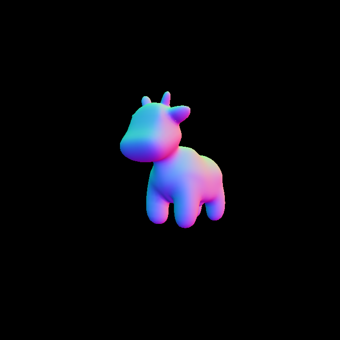
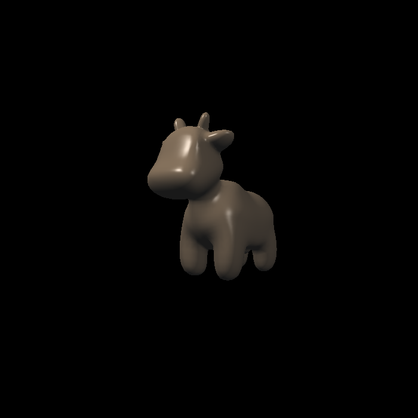
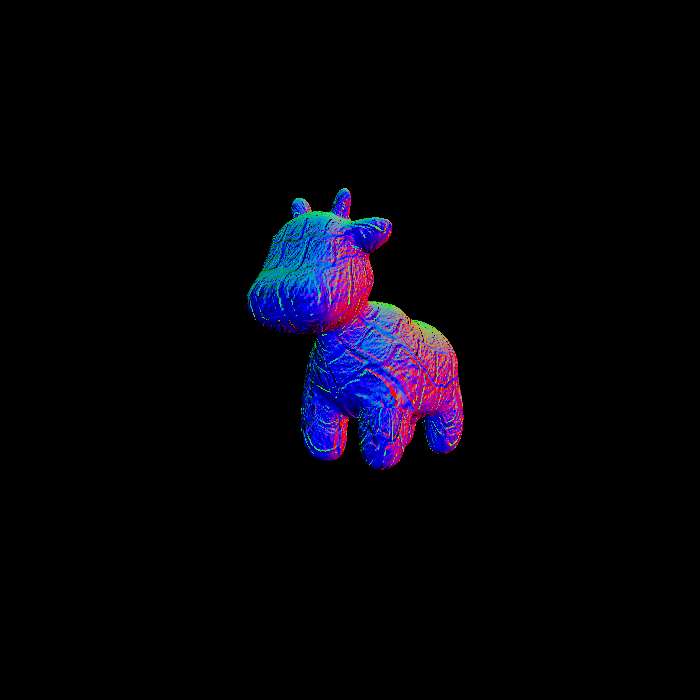
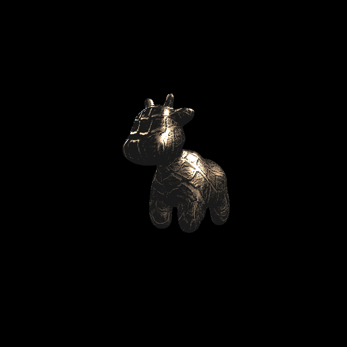

# DONE
- [5 分] 提交格式正确，包括所有需要的文件。代码可以正常编译、执行。
- [10 分] 参数插值: 正确插值颜色、法向量、纹理坐标、位置 (Shading Position)并将它们传递给 fragment_shader_payload.

    

- [20 分] Blinn-phong 反射模型: 正确实现 phong_fragment_shader 对应的反射模型。

    

- [5 分] Texture mapping: 将 phong_fragment_shader 的代码拷贝到 texture_fragment_shader, 在此基础上正确实现 Texture Mapping.
- [Bonus 5 分] 双线性纹理插值: 使用双线性插值进行纹理采样, 在 Texture 类中实现一个新方法 Vector3f getColorBilinear(float u, float v) 并通过 fragment shader 调用它。

    
    
texture.png

    
    
texture_bilinear.png

- [10 分] Bump mapping 与 Displacement mapping: 正确实现 Bump mapping 与 Displacement mapping.

    

    

# TODO
- [Bonus 3 分] 尝试更多模型: 找到其他可用的.obj 文件，提交渲染结果并把模型保存在 /models 目录下。这些模型也应该包含 Vertex Normal 信息。
