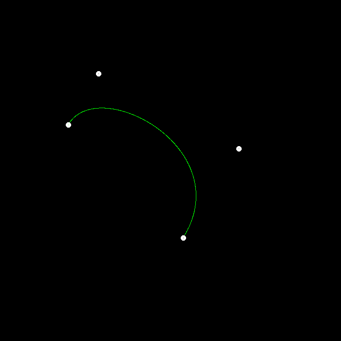
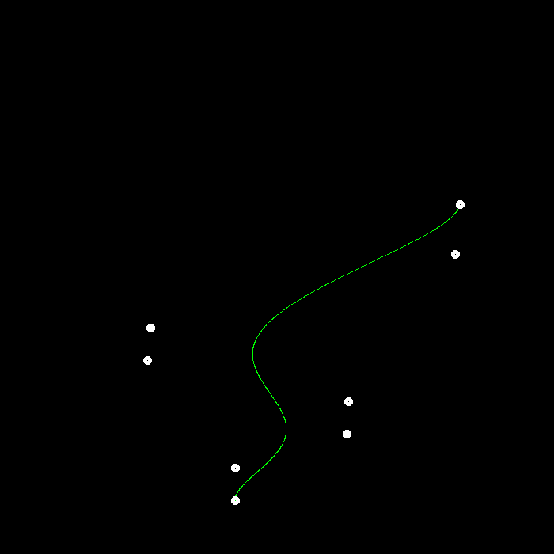
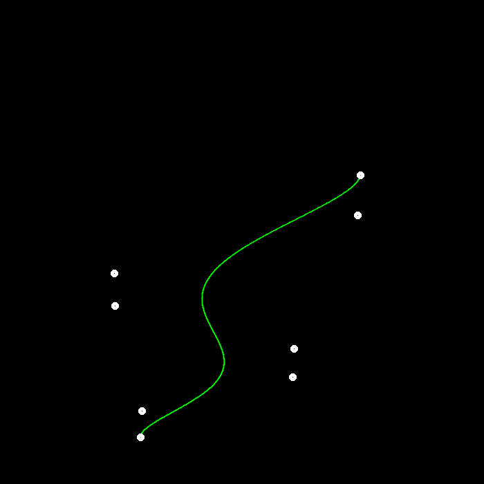

# DONE
- [5 分] 提交格式正确，包括所有需要的文件。代码可以正常编译、执行。
- [20 分] De Casteljau 算法：对于给定的控制点，你的代码能够产生正确的 Bézier 曲线。

    

    4-point bezier curve.png

    

    8-point bezier curve.png

- [5 分] 奖励分数：实现对 Bézier 曲线的反走样。(对于一个曲线上的点，不只把它对应于一个像素，你需要根据到像素中心的距离来考虑与它相邻的像素的颜色。)

    

    8-point bezier curve with Anti-aliasing.png

