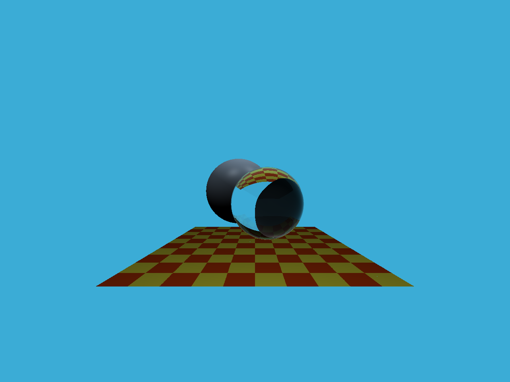

# Nicolas-L0/GAMES101/pa5
- [5 分] 提交的格式正确，包含所有必须的文件。代码可以编译和运行。
- [10 分] 光线生成：正确实现光线生成部分，并且能够看到图像中的两个球体。
- [15 分] 光线与三角形相交：正确实现了 Moller-Trumbore 算法，并且能够看到图像中的地面。

    

    pa5_output.png

`ffmpeg -i binary.ppm pa5_output.png`